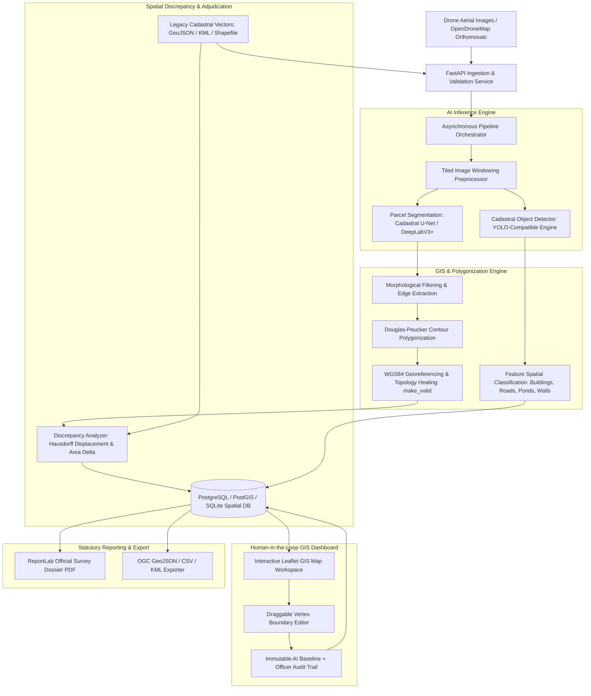
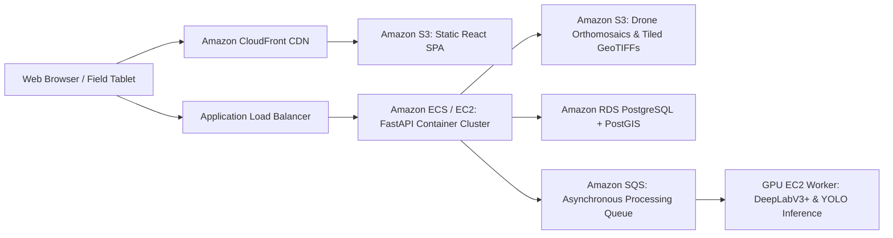

# BHOOMI-AI: System Architecture & Technical Specifications

> **Platform:** BHOOMI-AI  
> **Tagline:** *"From Drone Imagery to Verified Digital Land Maps."*  
> **Initiative:** Smart India Hackathon (SIH26012) • Ministry of Rural Development  
> **Target Programmes:** SVAMITVA Scheme & Digital India Land Records Modernization Programme (DILRMP)

---

## 1. High-Level System Architecture

BHOOMI-AI is designed around an end-to-end, asynchronous GIS & AI pipeline that ingests high-resolution drone orthomosaics and legacy revenue vectors, isolates field parcels and cadastral objects, screens for spatial boundary shifts, and presents an authorized Survey Officer verification interface.

---

## 2. Component Breakdown

### 2.1 Backend Services (`backend/app/`)

- **API Layer (`app/api/`)**:
  - `auth.py`: JWT access token issuance, verification, and role-based access control (`admin`, `survey_officer`, `viewer`).
  - `surveys.py`: Metadata intake, imagery upload, background pipeline trigger, real-time status polling, and one-click demo dataset provisioning.
  - `parcels.py`: Parcel queries with spatial filters, human-in-the-loop geometry modification (`PUT /parcels/{id}/geometry`), statutory verification approval/rejection, and audit history.
  - `features.py`: Ingestion and retrieval of detected cadastral objects (habitations, road centerlines, water reservoirs, boundary bunds).
  - `change_detection.py`: Multi-temporal comparison between Survey $T_1$ and Survey $T_2$.
  - `ai_assistant.py`: Natural language spatial query interpreter executing safe, SQL-injection-proof Shapely spatial intersections.
  - `analytics.py`: Real-time KPI aggregation and Recharts visualization feeds.
  - `reports.py`: Streaming ReportLab PDF dossiers and OGC geospatial exports.

- **AI & Computer Vision Layer (`app/ai/`)**:
  - `parcel_segmentation/segmenter.py`:
    - PyTorch implementation of `CadastralUNet` with lightweight encoder-decoder skip connections.
    - Large orthomosaic tiling with sliding window overlap to process gigapixel drone imagery without GPU/CPU memory overflow.
    - Realistic Computer Vision fallback pipeline: Bilateral edge preservation, CLAHE contrast enhancement, multi-scale Canny edge extraction, morphological closing, and connected-component spatial filtering.
  - `feature_detection/detector.py`:
    - YOLO-compatible abstraction for detecting buildings, roadways, ponds, and agricultural plots with bounding boxes, confidence ratings, and polygon geometries.

- **GIS & Spatial Analysis Layer (`app/gis/`)**:
  - `polygonizer.py`: Converts binary raster masks into georeferenced EPSG:4326 polygons via `cv2.findContours` and Douglas-Peucker geometric simplification (`cv2.approxPolyDP`), resolving interior holes (courtyards/exclusions).
  - `geometry_utils.py`: Metric transformations using local latitude-scaled projections to compute exact surface area in square meters and acres ($1 \text{ acre} = 4046.856 \text{ m}^2$), perimeter, and centroid coordinates.
  - `discrepancy.py`: Metric Hausdorff boundary displacement calculation, area delta percentage, and Intersection-over-Union (IoU) spatial overlap calculation.
  - `spatial_queries.py`: Rule-based NLP intent parser mapping queries like *"Show buildings inside agricultural parcels"* to Shapely spatial intersections.

- **Storage & Services Layer (`app/services/`)**:
  - `storage.py`: Abstract storage interface structuring files into `storage/surveys/{id}/input/`, `processed/`, `masks/`, `vectors/`, and `reports/`.
  - `reports.py`: Generates official PDF dossiers using ReportLab with Government of India header, executive KPIs, discrepancy matrices, parcel inventory, and signature blocks.
  - `export.py`: High-fidelity GeoJSON, CSV, and KML generators preserving geographic datum integrity.
  - `demo_data.py`: Pre-configured synthetic village orthomosaic generator and realistic cadastral data for Ramnagar Village.

---

## 3. Human-in-the-Loop (HITL) Verification Model

Under statutory Indian land administration frameworks, automated AI predictions cannot legally bind land title. BHOOMI-AI operationalizes a strict Decision-Support Model:

1. **Immutable AI Detection Baseline:**
   - Every parcel records `original_geometry` (immutable AI detection) and `geometry` (current boundary).
2. **Interactive Vertex Editing:**
   - Survey Officers can enter edit mode on the Leaflet map, drag corner pins, and view the original vs modified boundary in real time.
3. **Statutory Audit Trail:**
   - Edits require a mandatory official justification (`reason`).
   - Every modification is recorded in `VerificationHistory` with timestamp, officer name, old geometry, and new geometry.

---

## 4. Cloud & AWS Deployment Architecture

For scalable state or national rollout, BHOOMI-AI deploys natively on AWS:

